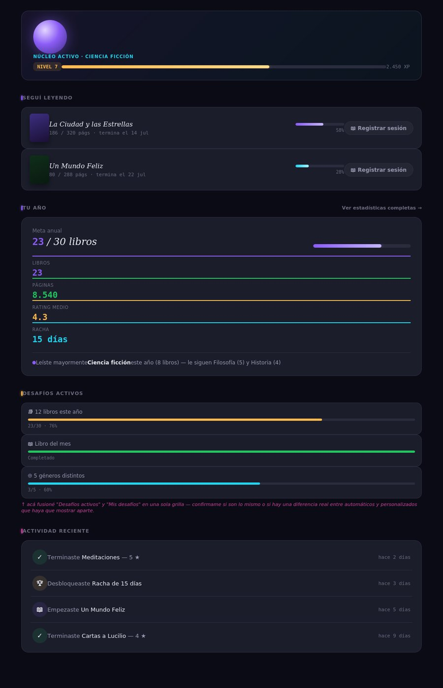
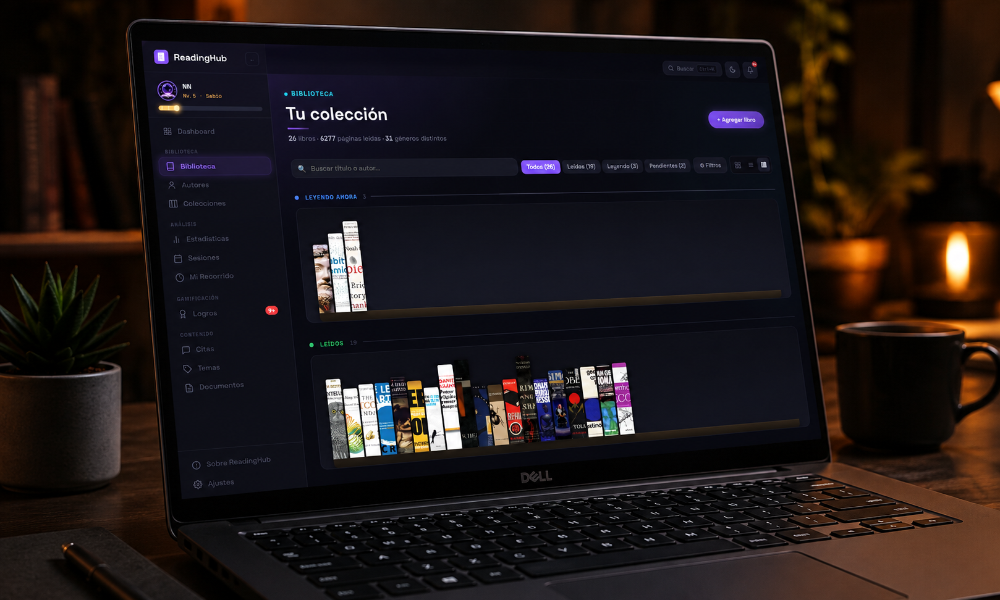
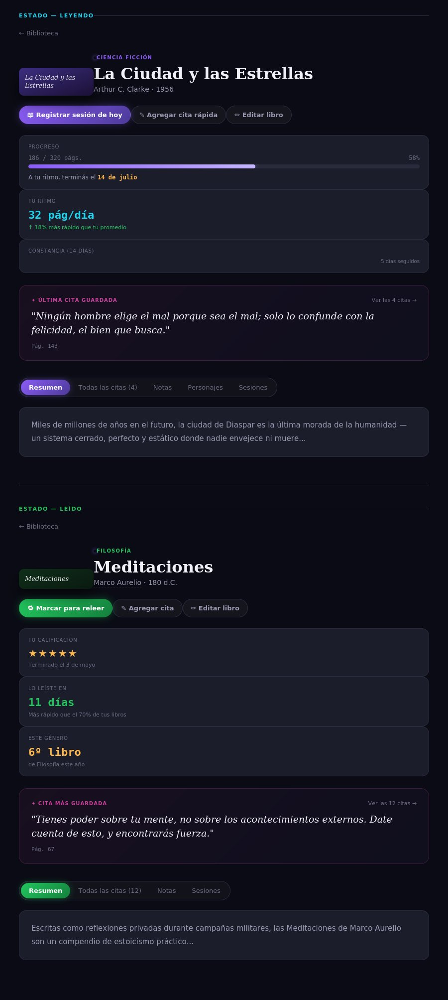

# ReadingHub

<p align="left">
  
  
  
  
</p>

> Tu sistema personal de lectura. 100% local, sin cuentas, sin nube, sin publicidad.

Una app de escritorio para llevar el registro completo de tu vida lectora — con gamificación, estadísticas que cuentan una historia, y una identidad visual propia en vez del look genérico de cualquier dashboard.

Vive en tu computadora. Corre con un comando. Tus datos nunca salen de tu máquina.

### Índice

- [Capturas](#capturas)
- [Por qué existe](#por-qué-existe)
- [Qué hace](#qué-hace)
- [Instalación](#instalación)
- [Tus datos](#tus-datos)
- [Stack técnico](#stack-técnico)
- [Roadmap](#roadmap)
- [Licencia](#licencia)

---

## Capturas

<p align="center">
  <br>
  <em>Dashboard — el núcleo, tu racha, y lo que estás leyendo ahora</em>
</p>

<p align="center">
  <br>
  <em>Biblioteca — portadas a sangre completa, vista estante con lomos reales</em>
</p>

<p align="center">
  <br>
  <em>Detalle de libro — acciones rápidas, ritmo de lectura, fecha estimada de fin</em>
</p>

<p align="center">
  <br>
  <em>Estadísticas — análisis de lectura, comparativa de años</em>
</p>

---

## Por qué existe

Las alternativas para trackear lecturas (Goodreads, StoryGraph y similares) piden crear una cuenta, mandan tus datos a un servidor de otra empresa, y tienen una interfaz genérica que no se puede personalizar. ReadingHub nace de la idea contraria:

- **Tus datos son tuyos.** Todo vive en un archivo JSON en tu disco. Nada se sube a ningún lado, nunca.
- **Sin fricción de cuenta.** No hay login, no hay "olvidé mi contraseña", no hay onboarding de 10 pasos.
- **Gamificación real, no cosmética.** XP, niveles, 42+ logros en 5 rarezas, desafíos — pensado para motivar el hábito, no para generar ansiedad de ranking (no hay comparación social, no hay nada público).
- **Una identidad visual propia.** Todo el sistema de diseño — paleta, tipografía, el orbe que responde a tu racha y a lo que estás leyendo.

---

## Qué hace

| | |
|---|---|
| 📚 **Biblioteca completa** | Portadas reales o generadas, grid / lista / estante, filtros por estado, formato y tag |
| 📊 **Estadísticas con contexto** | Comparativa año a año, ritmo de lectura, fecha estimada de finalización — no solo números sueltos |
| 🎮 **Gamificación con sentido** | XP, 9 niveles, 42+ logros, desafíos automáticos y personalizados |
| 💬 **Citas y notas** | Guardá lo que te voló la cabeza, con vista destacada en la ficha del libro |
| 🎧 **Audiolibros** | Tratamiento diferenciado — duración, minutos escuchados, estadísticas propias |
| 📝 **Documentos en Markdown** | Un espacio propio para reflexiones largas, con preview en vivo |
| 🔍 **Búsqueda instantánea** | Ctrl+K para buscar en libros, citas, notas y documentos sin salir de donde estás |
| 🌗 **Modo claro y oscuro** | Con contraste verificado de verdad, no solo "invertir colores" |

---

## Instalación

### Requisitos

- **Node.js 18+** — [descargar en nodejs.org](https://nodejs.org)

### 1. Descargar

```bash
git clone https://github.com/enedos/readinghub.git
cd readinghub
```

(o descargá el ZIP desde GitHub y descomprimilo)

### 2. Arrancar

**Mac / Linux**
```bash
chmod +x start.sh   # solo la primera vez
./start.sh
```

**Windows** — doble click en `start.bat`

**Manual (cualquier sistema)**
```bash
npm install --prefix server
node server/index.js
```

Abrí **http://localhost:3001** en tu navegador.

La primera vez, la biblioteca aparece vacía — hay un botón para **cargar una biblioteca de ejemplo** (25 libros con citas, personajes y progreso) si querés ver la app en uso antes de cargar tus propios libros. Se borra con un click desde Ajustes → Datos.

---

## Tus datos

```
readinghub/
  server/
    data/
      readinghub.json   ← todos tus datos: libros, citas, notas, logros
    covers/               ← portadas que subís
```

**Backup:** copiá la carpeta `server/data/` a un lugar seguro. Eso es todo — es un JSON plano, lo podés abrir con cualquier editor de texto si alguna vez necesitás mirarlo a mano.

---

## Stack técnico

**Frontend:** React 18 + TypeScript + Vite · Recharts · React Router
**Backend:** Node.js + Express + LowDB (JSON como base de datos, sin servidor de base de datos separado)
**Diseño:** sistema propio — Space Grotesk, Fraunces, JetBrains Mono

Para compilar el cliente después de modificar el código:

```bash
cd client
npm install --legacy-peer-deps
npm run build
```

---

## Roadmap

Esto está vivo, no terminado. Lo que viene:

- 🎨 **Ilustraciones propias para los logros** — hoy son orbes con un símbolo; la idea es darle a cada rareza y categoría una pieza ilustrada real
- ⚡ **Mejoras de funcionalidad** — series de libros con progreso, préstamos, importación desde Goodreads, acciones en lote en la biblioteca
- 🤖 **IA 100% local** — recomendaciones basadas en tu propio historial y búsqueda semántica en tus notas y citas (vía Ollama, corriendo en tu máquina — sin mandar una palabra a ningún servidor externo)
- 📱 **PWA instalable** — que se pueda "instalar" en tu escritorio o celular y abrir en su propia ventana, sin sentirse una pestaña de navegador
- 💾 **Backups automáticos rotativos** — snapshots programados sin tener que acordarte de hacerlo a mano

Si te sirve la app y le falta algo puntual, los issues son bienvenidos.

---

## Licencia

MIT — usalo, modificalo, lo que quieras. Ver [LICENSE](LICENSE).

---

<p align="center"><em>Hecho con amor y café. Cada página leída es un paso hacia algo más grande.</em></p>
